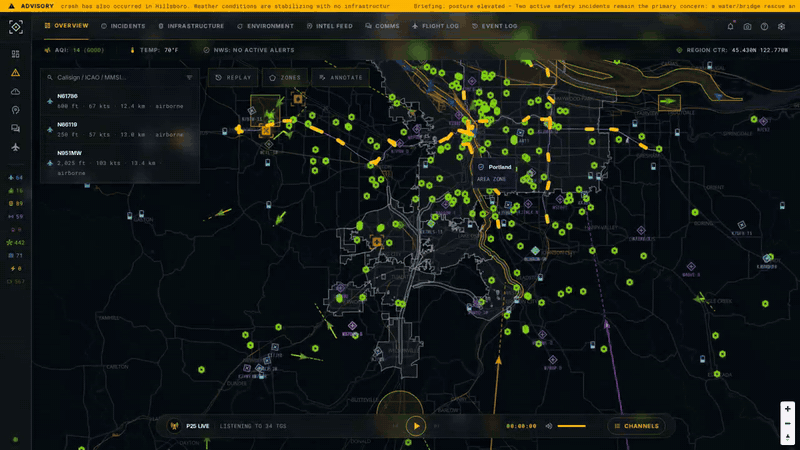
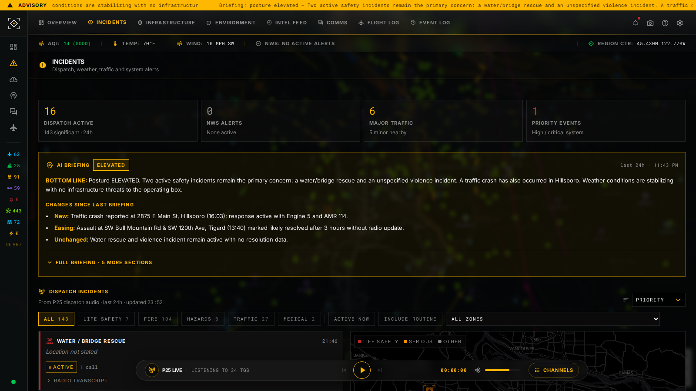
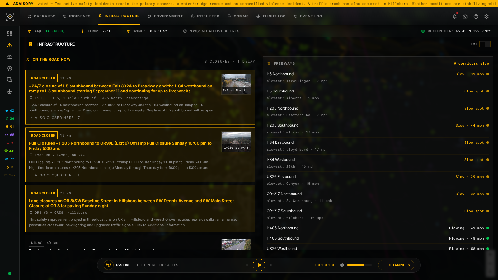
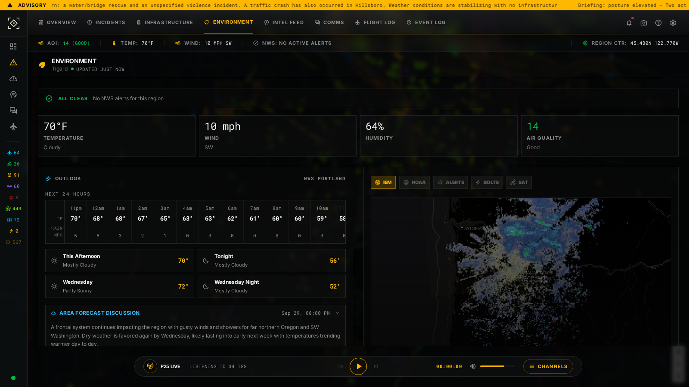
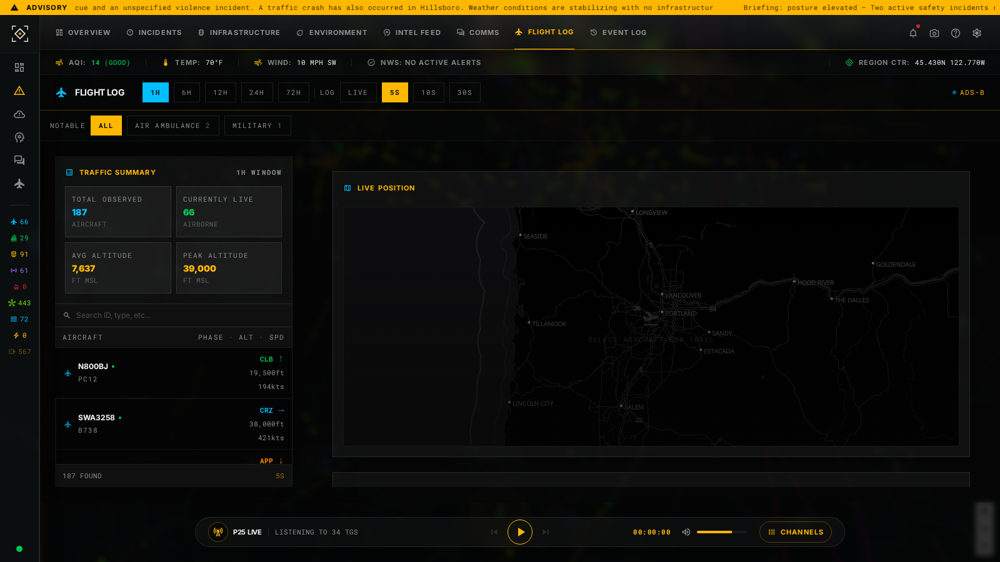
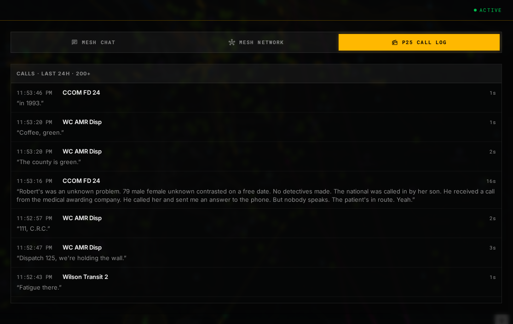
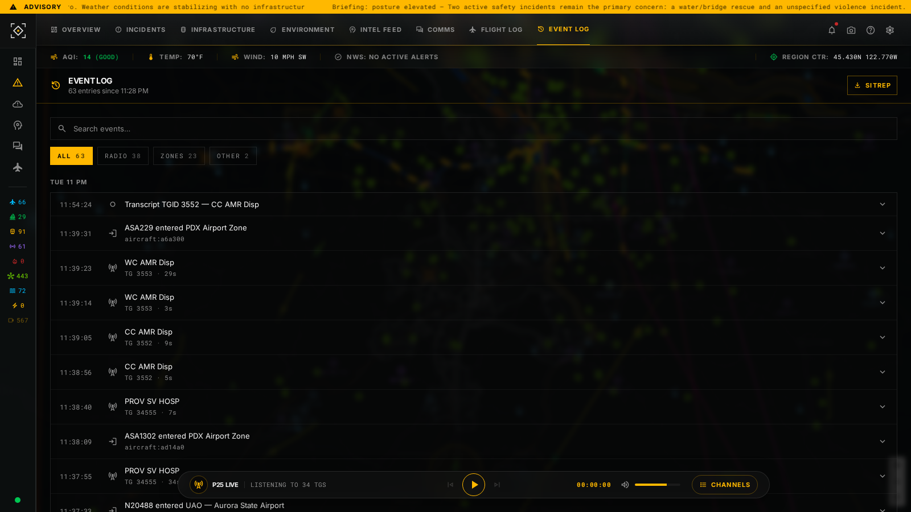
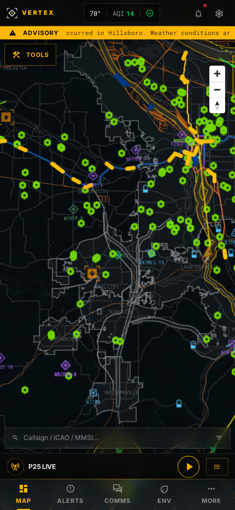
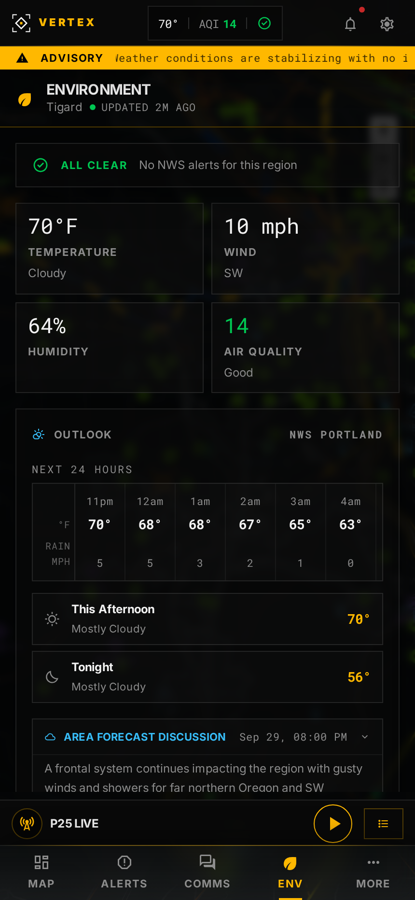

<div align="center">


<br />


**Real-time situational awareness. Local-first. No cloud required.**

</div>

---

## // 00 · BRIEF

Vertex fuses aircraft, vessels, traffic, weather, emergency alerts, trunked radio, mesh networks, and community feeds into a single map-centric dashboard that runs on hardware you control. Onyx surfaces, amber-gold signal accents, and a desaturated tactical map keep the focus where it belongs: on the data.

```
DOMAIN · PUBLIC SAFETY    DENSITY · HIGH / DATA-FIRST
THEME  · DARK ONLY        RADIUS  · 0px / ALL
```

<div align="center">

[](docs/video/vertex-tour.mp4)

<sub>Animated preview · [full tour with P25 radio audio (MP4)](docs/video/vertex-tour.mp4)</sub>


</div>

## // 01 · WHAT IT DOES

- **Live map** — aircraft, vessels, APRS, mesh nodes, trains, fires, quakes, lightning, radar and smoke on one MapLibre + Deck.gl surface, with trails, replay, geofences and annotations.
- **Aircraft with a job** — air ambulances, rescue, police, fire and military aircraft get a role glow, a "Notable" filter on the flight log, and events when they show up. Roles come from registration and owner data, never guessed from callsigns.
- **Radio you can read** — P25 calls are recorded from a local OP25 decoder, transcribed, grouped into incidents, and streamed live in the browser.
- **Infrastructure triage** — freeway corridor status, road closures folded under their parent event, message signs, and power-outage areas with weather and lightning context.
- **Environment** — air quality, weather history, nearby NWS and road-weather stations, wildfire danger, FIRMS hotspots and stream gauges, in priority order.
- **Briefings** — an on-box LLM writes situation reports from the same data; nothing leaves your network.

<div align="center">

| Incidents | Infrastructure |
|:---:|:---:|
|  |  |
| **Environment** | **Flight log** |
|  |  |
| **P25 call log** | **Event log** |
|  |  |

&nbsp;&nbsp;

</div>

## // 02 · ARCHITECTURE

One compose file, seven containers.

| Container | Role | Entry point |
|-----------|------|-------------|
| `db` | PostgreSQL 16 + PostGIS 3.4 | `db/` init scripts |
| `redis` | State cache + pub/sub event bus | Stock image |
| `mosquitto` | MQTT broker for IoT sensors (rtl_433, Meshtastic) | Stock image |
| `backend` | FastAPI REST + WebSocket API | `backend/main.py` |
| `poller` | Async pollers for every data source | `poller/main.py` |
| `transcription` | Speech-to-text for recorded radio calls | `transcription/` |
| `frontend` | React + MapLibre GL, Nginx-served | `frontend/src/main.tsx` |

```
External APIs / SDR hardware / MQTT
        ↓
    poller (async tasks per source)
        ↓  bulk INSERT
    PostgreSQL ← PostGIS geofence queries
        ↓  Redis pub/sub
    backend WebSocket /ws
        ↓  JSON events
    frontend Zustand → Deck.gl → MapLibre GL
```

## // 03 · DATA SOURCES

| Signal | Source |
|--------|--------|
| Aircraft (ADS-B) | Local BEAST decoder → airplanes.live / adsb.fi community feeds → OpenSky (gap-filler) |
| Vessels (AIS) | AIS-catcher (local) or AISstream.io |
| P25 radio | OP25 trunked-radio decoder (local SDR), Whisper transcription |
| Weather, alerts | NWS observations and alerts, AirNow, ODF fire danger, NIFC, FIRMS |
| Traffic, infrastructure | ODOT TripCheck (incidents, cameras, signs), Oregon ODIN power outages |
| Emergency | FlashAlert, county emergency management RSS, TVF&R |
| Mesh, ham | MeshCore repeaters and companions, APRS-IS |
| Rail, hazards | Amtrak, TriMet GTFS-RT, USGS quakes, GDACS, lightning |

**How aircraft feeds are merged.** Every aircraft keeps one live position, always the freshest available: the local BEAST receiver wins, community feeds fill in beyond its range (~0.3 s old), and OpenSky (OAuth2, ~8–60 s old) only covers aircraft the others miss. An older fix never overwrites a newer one.

## // 04 · QUICK START

```bash
cp .env.example .env
cp config/sources.example.yml config/sources.yml

# Edit .env with your region, API keys, and data sources
$EDITOR .env

docker compose up -d
```

Open `http://localhost`. For detailed setup, see [docs/getting-started.md](docs/getting-started.md).

Set `REGION_LAT` / `REGION_LON` in `.env` to center the map and the receiver range ring (restart the backend and poller to apply). The frontend reads the region at runtime, so no rebuild is needed.

## // 05 · DOCUMENTATION

| Document | Description |
|----------|-------------|
| [Getting Started](docs/getting-started.md) | Installation, configuration, first run |
| [Architecture Overview](docs/architecture/overview.md) | Service layout and data flow |
| [Feature Overview](docs/features/overview.md) | Dashboard features and panels |
| [Map Key](docs/map-key.md) | Icon meanings, zoom behavior, and colors |
| [Environment Config](docs/configuration/environment.md) | `.env` variable reference |
| [Source Config](docs/configuration/sources.md) | `sources.yml` reference |

## // 06 · LICENSE

GPL-3.0 — see [LICENSE](LICENSE).

## // 07 · DEPLOYMENT

### Prerequisites

- A 64-bit Linux host or VM — Vertex is developed and run on a 4 vCPU / 3 GB Linux VM
- Raspberry Pi 5 (8 GB) is the design target for low-power installs, but it has not been tested there yet
- Docker CE (`docker.io` + `docker-compose-plugin`)
- A `.env` file configured from `.env.example`

### First-time install

Set the repo URL, then run the install script:

```bash
export VERTEX_REPO_URL=https://github.com/d3mocide/Vertex.git
curl -fsSL https://raw.githubusercontent.com/d3mocide/Vertex/main/infra/install.sh | sudo -E bash
```

If you have already cloned the repo locally:

```bash
export VERTEX_REPO_URL=https://github.com/d3mocide/Vertex.git
sudo -E bash infra/install.sh
```

After the script completes, edit `/opt/vertex/.env` with your region, API keys, and data sources.

### Update

```bash
sudo bash /opt/vertex/infra/update.sh
```

This pulls the latest code and images, then restarts the service via systemd.

### Service management

```bash
sudo systemctl status vertex        # Show service status
sudo systemctl stop vertex          # Stop the stack
sudo systemctl start vertex         # Start the stack
sudo journalctl -u vertex -f        # Follow live logs
```

### Resource notes

The full stack idles at roughly 1.2 GB RAM (the poller and transcription containers are the largest) and grows with the number of sources enabled. Resource limits are pre-configured in `docker-compose.yml` and can be tuned for your hardware.
